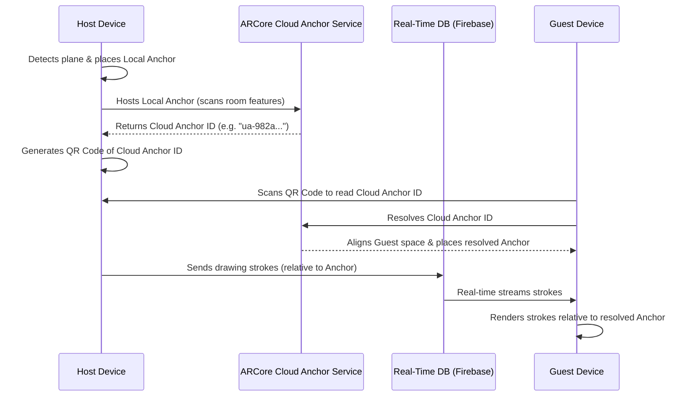

# Shared AR Implementation Plan (Multi-Device Sync)

This document details the architectural design and code implementation plan to share AR scenes (drawings and model placements) between multiple phones in the same room using **ARCore Cloud Anchors** and a **real-time synchronizer (Firebase)**.

---

## 1. Architectural Concept

When two phones run ARCore, their coordinate spaces are completely independent. To see objects in the same physical space, we need a **Shared Spatial Anchor**.



---

## 2. Key Technology Stack

1. **ARCore Cloud Anchors:** Hosted by Google, translates a local anchor into a cloud-hosted coordinate node based on room features.
2. **QR Code Library:** 
   - **Generation:** [ZXing (Zebra Crossing)](https://github.com/zxing/zxing) to display the QR Code.
   - **Scanning:** [Google ML Kit Barcode Scanning](https://developers.google.com/ml-kit/vision/barcode-scanning) (fast, offline, runs on camera frames).
3. **Real-Time Synchronizer:** [Firebase Realtime Database](https://firebase.google.com/docs/database) (low latency, reactive listeners).

---

## 3. Step-by-Step Implementation

### Step 1: Gradle Dependencies
Add ZXing, ML Kit, and Firebase to your catalog and app-level `build.gradle.kts`:

```kotlin
// gradle/libs.versions.toml
[versions]
playServicesMlkitBarcodeScanning = "18.3.0"
zxingAndroidEmbedded = "4.3.0"
firebaseDatabaseKtx = "20.3.0"

[libraries]
mlkit-barcode-scanning = { group = "com.google.mlkit", name = "barcode-scanning", version.ref = "playServicesMlkitBarcodeScanning" }
zxing-embedded = { group = "journeyapps", name = "zxing-android-embedded", version.ref = "zxingAndroidEmbedded" }
firebase-database = { group = "com.google.firebase", name = "firebase-database-ktx", version.ref = "firebaseDatabaseKtx" }
```

### Step 2: Configure ARCore Cloud Anchors
We must update `ArSessionConfig.kt` to enable Cloud Anchors:

```kotlin
fun configureArSession(session: Session, config: Config) {
    // ... existing config
    config.cloudAnchorMode = Config.CloudAnchorMode.ENABLED
}
```

### Step 3: Implement Database Sync Logic
Create a data structure for synchronized AR events (Stroke Points and Placed Models) with coordinates represented **locally relative to the Cloud Anchor** instead of world space:

```kotlin
data class ArSyncNode(
    val type: String = "sphere", // "sphere" or "duck"
    val posX: Float = 0f,
    val posY: Float = 0f,
    val posZ: Float = 0f,
    val scale: Float = 1f,
    val colorHex: String = "#FF00FF"
)
```

### Step 4: Host Anchor Logic (Host Device)
When the host taps a surface to establish a "room":
1. Place a local `AnchorNode`.
2. Host it via `CloudAnchorNode`.
3. Save the returned `cloudAnchorId` to Firebase and display it as a QR code.

```kotlin
val localAnchor = hitResult.createAnchorOrNull()
if (localAnchor != null) {
    val cloudAnchorNode = CloudAnchorNode(engine, localAnchor)
    childNodes += cloudAnchorNode
    
    // Begin hosting (valid for 24 hours by default)
    cloudAnchorNode.host(session, 1) { cloudAnchorId, state ->
        if (state == Anchor.CloudAnchorState.SUCCESS) {
            // 1. Display QR Code with cloudAnchorId
            activeRoomId = cloudAnchorId
            
            // 2. Start writing drawing coordinates to Firebase under:
            // "rooms/$cloudAnchorId/nodes"
        }
    }
}
```

### Step 5: Resolve Anchor & Sync Logic (Guest Device)
When the guest scans the QR Code:
1. Obtain the `cloudAnchorId` from the barcode scan.
2. Call `CloudAnchorNode.resolve` to align the guest's coordinate space.
3. Attach a Firebase listener to draw points as they arrive in real-time.

```kotlin
CloudAnchorNode.resolve(engine, session, scannedId) { state, resolvedNode ->
    if (state == Anchor.CloudAnchorState.SUCCESS) {
        childNodes += resolvedNode
        
        // Listen to Firebase room database
        database.reference.child("rooms").child(scannedId).child("nodes")
            .addChildEventListener(object : ChildEventListener {
                override fun onChildAdded(snapshot: DataSnapshot, previousChildName: String?) {
                    val syncNode = snapshot.getValue(ArSyncNode::class.java) ?: return
                    
                    // Instantiate Node relative to the resolved CloudAnchorNode
                    if (syncNode.type == "sphere") {
                        val sphereNode = SphereNode(engine, syncNode.scale, ...)
                        sphereNode.position = Float3(syncNode.posX, syncNode.posY, syncNode.posZ)
                        resolvedNode.addChildNode(sphereNode)
                    } else if (syncNode.type == "duck") {
                        // Place duck model relative to resolvedNode
                    }
                }
                // ... other overrides
            })
    }
}
```

---

## 4. Google Cloud Setup Required

Because Cloud Anchors use Google services, you must:
1. Go to the [Google Cloud Console](https://console.cloud.google.com/).
2. Enable the **ARCore Cloud Anchor API** on your project.
3. Generate an **API Key** (restrict it to Android application requests).
4. Add the API Key inside your `AndroidManifest.xml` under `<application>`:
   ```xml
   <meta-data
       android:name="com.google.android.ar.API_KEY"
       android:value="YOUR_API_KEY_HERE" />
   ```
